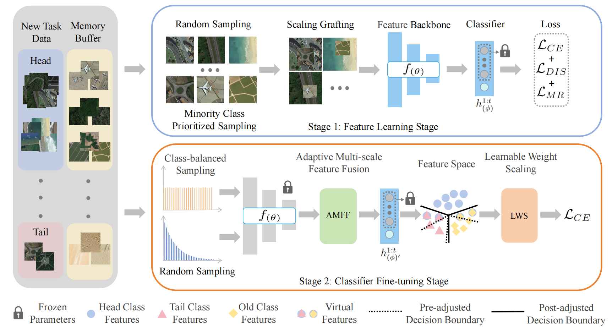

# TGRS-CEF_CL-main
<!-- ## News
___ -->
## [TGRS2025]Continually Evolved Feature and Classifiers Learning for Long-tailed Class-incremental Remote Sensing Scene Classification

This is the official PyTorch implementation of **CEF_CL**([IEEE TGRS](https://ieeexplore.ieee.org/document/11114081)).

## Method Overview


Remote sensing data from real-world scenarios manifests a long-tailed distribution, with the continuous emergence of new classes over time. Nevertheless, the existing class-incremental remote sensing classification models neglect the above long-tailed distribution phenomenon, which seriously damages their overall superior performance. Meanwhile, long-tail class-incremental learning developed in other areas focuses only on the classifier decision boundary optimization of the tail-class, while neglecting the robustness of the feature backbone. The feature backbone trained on the base classes causes a serious significant distribution shift for the incremental classes owing to the distributional differences between base and incremental classes. To solve these issues, we propose a continually evolved feature and classifiers learning (CEF-CL) framework for long-tail class-incremental remote sensing scene classification. Specifically, tail-class data are scaled and grafted onto head-class data to diversify the semantic information of the tail-class leveraging the rich context of the head classes, which can improve the generalization of the feature backbone. And then, an adaptive multi-scale feature fusion (AMFF) module is proposed to couple feature maps of head and tail classes scale by scale for generating virtual tail-class features that deeply perceive head-class information, which can further enhance the reliability of classifier decision boundary optimization. Furthermore, examples from old classes are regarded as pseudo-tail classes to participate in incremental learning, which greatly alleviates catastrophic forgetting of old classes. Extensive experiments on two remote sensing benchmarks demonstrate the superiority of the proposed CEF-CL in comparison with existing class-incremental learning.

## Dataset Prepare

### NWPU-RESISC45
Download automaticly to `./data`.
### AID
Should be downloaded to `./data`. 

## Training

Scripts for the main experiments are provided. Their main usage is as follows: 

```
bash ./script_cifar100_no_gridsearch.sh <approach> <gpu> <datasets> <scenario> <cls_num_first_task> <num_tasks> [<results_dir>]
```

where: 
    
* `<approach>` - approach to be used, from the ones in `./src/approaches/`
* `<gpu>` - index of GPU to run the experiment on
* `<datasets>` - dataset to be used (NWPU-RESISC45, AID)
* `<scenario>` - specific rehearsal scenario (conv, lt, ltio)
* `<cls_num_first_task>` - the number of classes to be trained in the first base task
* `<num_tasks>` - the number of tasks (include the base task)
* `[<results_dir>]` - results directory (optional), by default it will be `./results`

## Demos


You can train a baseline model of LUCIR by:

```
bash ./script_cifar100_no_gridsearch.sh lucir 0 NWPU-RESISC45 conv 25 6
```

Train a model of LUCIR with 2stage method by:

```
bash ./script_cifar100_no_gridsearch.sh lucir_2stage 0 NWPU-RESISC45 conv 25 6
```

Train a model of CEF_CL method on shuffled long-tailed scenario by:

```
bash ./script_cifar100_no_gridsearch.sh cef_cl 0 NWPU-RESISC45 lt 25 6
```

Train a model of CEF_CL method on ordered long-tailed scenario by:

```
bash ./script_cifar100_no_gridsearch.sh cef_cl 0 NWPU-RESISC45 ltio 25 6
```


## Reference

If this work is useful for you, please cite us by:
```
@ARTICLE{11114081,
  author={Wang, Wuli and Song, Yu and Wang, Jianbu and Fu, Sichao and Ren, Peng and Qin, Huawei and Li, Wei and Ou, Weihua},
  journal={IEEE Transactions on Geoscience and Remote Sensing}, 
  title={Continually Evolved Feature and Classifiers Learning for Long-Tailed Class-Incremental Remote Sensing Scene Classification}, 
  year={2025},
  volume={63},
  pages={1-13},
  doi={10.1109/TGRS.2025.3596075}}
```

## Contact

If you have any questions about this work, please feel free to contact us (sy653565 AT 163 DOT com)

## Thanks

This code is based on [Long-Tailed-CIL](https://github.com/xialeiliu/Long-Tailed-CIL)


